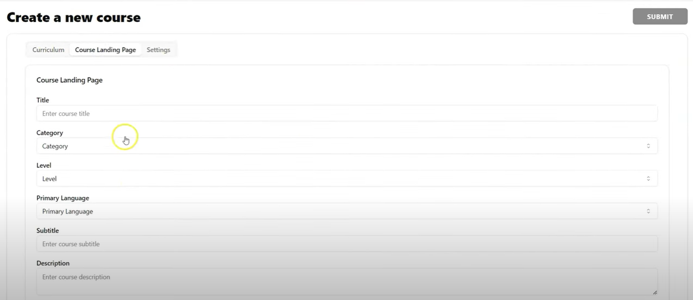

# Learning Platform

## Overview

A learning platform website that allows learners to access educational tutorials and provides admins with tools to upload and manage content. The platform includes a variety of interactive components for an engaging learning experience, leveraging React for the frontend and Express for the backend.

## Features

- Tutorial Library for Learners
- Learner Progress Tracking
- Confetti Animation for Completed Tutorials
- Admin Dashboard for Managing Tutorials
- Media Uploads with Cloudinary
- User Authentication
- Payment Integration with PayPal
- Responsive Design for Mobile and Desktop

## Technologies

- **Frontend:** Vite, React, Tailwind CSS, Radix UI, Zustand (for state management)
- **Backend:** Express.js, MongoDB, Cloudinary (for media management)
- **Utilities:** Axios, clsx, react-player, framer-motion, jwt, bcryptjs
- **Development Tools:** ESLint, Nodemon, PostCSS, Tailwind CSS Animate

## Project Screenshots

Here are some screenshots of the project, which can be found in the `demo` folder:





## Installation

1. **Clone the Repository**

   ```bash
   git clone https://github.com/yourusername/learning-platform.git
